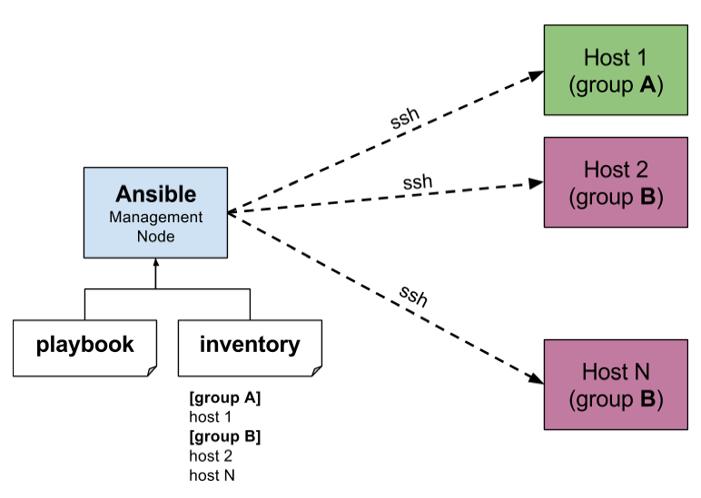
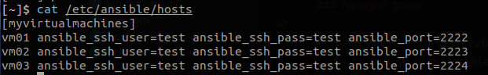
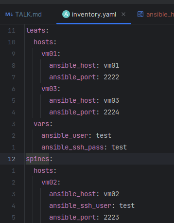

# Ansible: Introduction & Automation for Geo Cluster

## Introduction to Ansible


### What is Ansible?

- Ansible® is an open source, command-line IT automation software application written in Python. It can configure
  systems, deploy software, and orchestrate advanced workflows to support application deployment, system updates, and
  more.

### Key features of Ansible

Ansible aims to be:

1. **Clear** - Ansible uses a simple syntax (YAML) and is easy for anyone (developers,
   sysadmins, managers) to understand. APIs are simple and sensible.
2. **Fast** - Fast to learn, fast to set up—especially considering you don’t need to
   install extra agents or daemons on all your servers!
3. **Complete** - Ansible does three things in one (configuration management, server deployment, ad-hoc task execution),
   and does them very well. Ansible’s
   ‘batteries included’ approach means you have everything you need in one
   complete package.
4. **Efficient** - No extra software on your servers means more resources for your
   applications. Also, since Ansible modules work via JSON, Ansible is extensible
   with modules written in a programming language you already know.
5. **Secure** - Ansible uses SSH, and requires no extra open ports or potentially-
   vulnerable daemons on your servers.

## Ansible Architecture & Basic Concepts



Ansible is designed to be lightweight, agentless, and flexible, follows a client-server architecture, where a central
control node communicates with remote managed nodes to
automate and manage infrastructure configurations

### Control Node

- The control node is the machine where Ansible is installed and from where automation tasks are initiated. It acts as
  the central point of control and communication, run the Ansible CLI tools (_ansible-playbook, ansible,
  ansible-vault_, ...)
- The control node can be a physical or virtual machine.
- Multiple control nodes are possible
- Geo cluster is using node **Hlc-geo3** to communicate with all other nodes

### Managed Nodes

- These are the target devices (servers, network appliances or any computer) you aim to manage with Ansible
- Ansible is not normally installed on managed nodes

### Inventory

- A list of managed nodes provided by one or more ‘inventory sources’
- Inventory can specify information specific to each node, like IP address
- It is also used for assigning groups, that both allow for node selection in the Play and bulk variable assignment.
- Sometimes an inventory source file is also referred to as a ‘hostfile’.





### Playbooks

- Playbooks are files written in YAML format that define a set of tasks and configurations to be applied to managed
  nodes. Playbooks allow you to specify the desired state of the infrastructure and the order in which tasks should be
  executed. They provide a way to orchestrate and automate complex workflows. Playbooks can include variables,
  conditionals, loops, and even include other playbooks or roles.

### Modules

- In Ansible, modules are small, self-contained units of code that are responsible for performing specific tasks on
  managed nodes. They are the building blocks of automation in Ansible and serve as the primary means of interacting
  with the managed infrastructure.
- Modules encapsulate functionality related to various aspects of system administration, such as package management,
  file manipulation, service configuration, user management, network operations, and more. Ansible ships with a broad
  range of built-in modules that cover a wide variety of tasks commonly encountered in IT operations.
- Example, there are modules for installing packages (
  apt/yum/dnf/pacman), managing users (user), copying files (copy), manipulating files (lineinfile), and configuring
  services (service), among many others.

## Getting Started with Ansible

### Installation & Configuration

- Ensure that the control node meets the minimum system requirements for running Ansible. These requirements include
  having a supported operating system (such as Linux, macOS, or Windows with WSL), sufficient memory and disk space, and
  a stable network connection.
- The managed node (the machine that Ansible is managing) does not require Ansible to be installed, but requires Python
  2.7, or Python 3.5 - 3.11 to run Ansible library code. The managed node also needs a user account that can SSH to the
  node with an interactive shell.

### Inventory Management

Here's how inventory management works:

1. Defining Managed Nodes

```ansible
[web_servers]  # --> group name
server1.example.com # --> node
server2.example.com

[database_servers]
db1.example.com
db2.example.com
```

2. Grouping Managed Nodes

```ansible
[production:children] # --> parent group
web_servers
database_servers
```

3. Variables and Additional Information

```ansible
[web_servers]
server1.example.com ansible_user=ubuntu

[database_servers]
db1.example.com ansible_user=root

[production:vars]
http_port=80
max_connections=1000
```

### Ad-hoc Commands

Ansible ad-hoc commands are one-liner commands that allow you to perform quick tasks on managed nodes without the need
for writing a separate playbook. Ad-hoc commands are useful for executing simple tasks, running one-off commands, or
performing troubleshooting operations

- The basic syntax of Ad-hoc command:

  `ansible <host-pattern> -m <module> -a "<module arguments>"`

- **<host-pattern>**: Specifies the target hosts or groups of hosts. It can be a single host, a group of hosts defined
  in
  the inventory, or a pattern to match multiple hosts.
- **-m (module)**: Specifies the Ansible module to be executed on the target hosts.
- **-a "(module arguments)"**: Provides the arguments or parameters required by the specified module.

#### Examples

- Ping all hosts: `ansible all -m ping`:

  This command pings all hosts defined in the inventory to check if they are reachable

- Gather system facts: `ansible all -m setup`

  This command collects various system facts from all hosts, providing detailed information about the systems, including
  hardware, networking, and operating system details.

- Execute a shell command: `ansible web_servers -m shell -a "uptime"`

  This command runs the uptime command on the hosts belonging to the web_servers group, displaying the system's uptime.

- Install a package: `ansible db_servers -m apt -a "name=mysql-server state=present"`

  This command installs the mysql-server package on hosts belonging to the db_servers group using the apt module.

- Copy a file: `ansible web_servers -m copy -a "src=/path/to/local/file dest=/path/on/remote/server"`

  This command copies a file from the local system to the remote hosts belonging to the web_servers group using the copy
  module.

- Restart a service: `ansible app_servers -m service -a "name=httpd state=restarted"`

  This command restarts the httpd service on hosts belonging to the app_servers group using the service module.

## Ansible Playbooks & Roles

### Playbook Structure

### Variables & Facts

### Conditions & Loops

### Roles & Role-based Tasks

## Advanced Ansible Concepts

### Ansible Vault

### Ansible Galaxy

### Ansible Tower, Ansible AWX

## Automation for Geo cluster

### Apache NiFi

### Apache Airflow