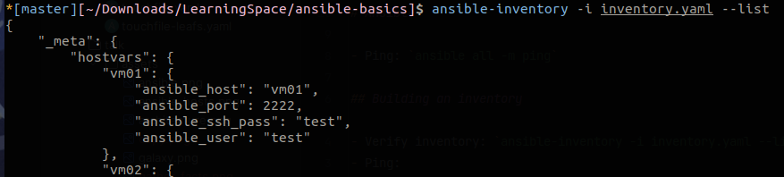
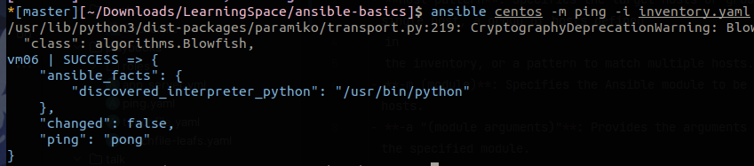
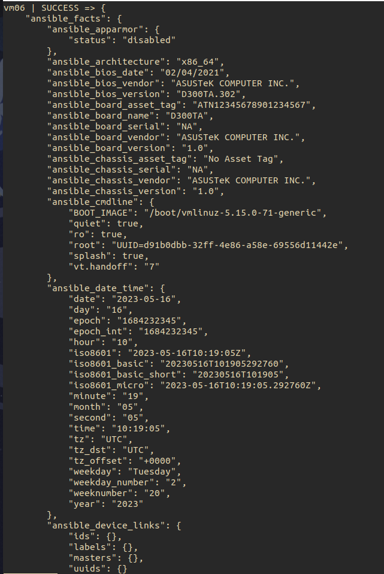
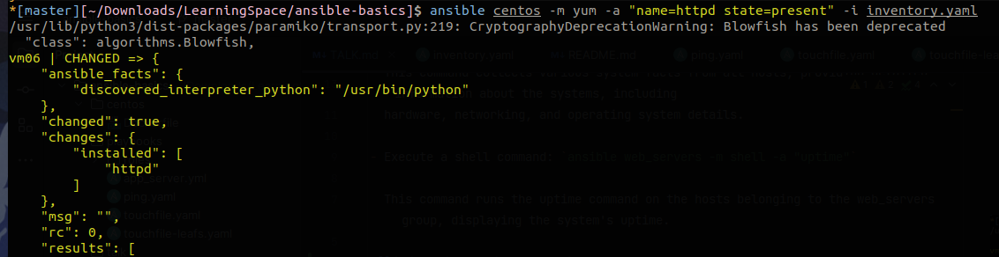
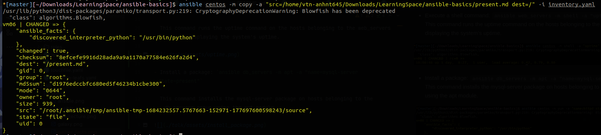
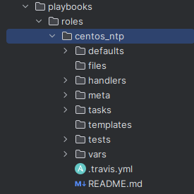
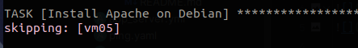

# Ansible: Introduction & Automation for Geo Cluster

## Introduction to Ansible

<p align="center">

</p>

### What is Ansible?

- Ansible® is an open source, command-line IT automation software application written in Python. It can configure
  systems, deploy software, and orchestrate advanced workflows to support application deployment, system updates, and
  more.

### Key features of Ansible

Ansible aims to be:

1. **Clear** - Ansible uses a simple syntax (YAML) and is easy for anyone (developers,
   sysadmins, managers) to understand. APIs are simple and sensible.
2. **Fast** - Fast to learn, fast to set up—especially considering you don’t need to
   install extra agents or daemons on all your servers!
3. **Complete** - Ansible does three things in one (configuration management, server deployment, ad-hoc task execution),
   and does them very well. Ansible’s
   ‘batteries included’ approach means you have everything you need in one
   complete package.
4. **Efficient** - No extra software on your servers means more resources for your
   applications. Also, since Ansible modules work via JSON, Ansible is extensible
   with modules written in a programming language you already know.
5. **Secure** - Ansible uses SSH, and requires no extra open ports or potentially-
   vulnerable daemons on your servers.

## Ansible Architecture & Basic Concepts


Ansible is designed to be lightweight, agentless, and flexible, follows a client-server architecture, where a central
control node communicates with remote managed nodes to
automate and manage infrastructure configurations

### Control Node

- The control node is the machine where Ansible is installed and from where automation tasks are initiated. It acts as
  the central point of control and communication, run the Ansible CLI tools (_ansible-playbook, ansible,
  ansible-vault_, ...)
- The control node can be a physical or virtual machine.
- Multiple control nodes are possible
- Geo cluster is using node **Hlc-geo3** to communicate with all other nodes

### Managed Nodes

- These are the target devices (servers, network appliances or any computer) you aim to manage with Ansible
- Ansible is not normally installed on managed nodes

### Inventory

- A list of managed nodes provided by one or more ‘inventory sources’
- Inventory can specify information specific to each node, like IP address
- It is also used for assigning groups, that both allow for node selection in the Play and bulk variable assignment.
- Sometimes an inventory source file is also referred to as a ‘hostfile’.

- /etc/ansible/hosts

```shell
[myvirtualmachines]
vm01 ansible_ssh_user=test ansible_ssh_pass=test ansible_port=2222
vm02 ansible_ssh_user=test ansible_ssh_pass=test ansible_port=2223
vm03 ansible_ssh_user=test ansible_ssh_pass=test ansible_port=2224
```

- inventory.yml

```yaml
leafs:
  hosts:
    vm01:
      ansible_host: vm01
      ansible_port: 2222
    vm03:
      ansible_host: vm03
      ansible_port: 2224
  vars:
    ansible_user: test
    ansible_ssh_pass: test
```

### Playbooks

- Playbooks are files written in YAML format that define a set of tasks and configurations to be applied to managed
  nodes. Playbooks allow you to specify the desired state of the infrastructure and the order in which tasks should be
  executed. They provide a way to orchestrate and automate complex workflows. Playbooks can include variables,
  conditionals, loops, and even include other playbooks or roles.

### Modules

- In Ansible, modules are small, self-contained units of code that are responsible for performing specific tasks on
  managed nodes. They are the building blocks of automation in Ansible and serve as the primary means of interacting
  with the managed infrastructure.
- Modules encapsulate functionality related to various aspects of system administration, such as package management,
  file manipulation, service configuration, user management, network operations, and more. Ansible ships with a broad
  range of built-in modules that cover a wide variety of tasks commonly encountered in IT operations.
- Example, there are modules for installing packages (
  apt/yum/dnf/pacman), managing users (user), copying files (copy), manipulating files (lineinfile), and configuring
  services (service), among many others.

## Getting Started with Ansible

### Installation & Configuration

- Ensure that the control node meets the minimum system requirements for running Ansible. These requirements include
  having a supported operating system (such as Linux, macOS, or Windows with WSL), sufficient memory and disk space, and
  a stable network connection.
- The managed node (the machine that Ansible is managing) does not require Ansible to be installed, but requires Python
  2.7, or Python 3.5 - 3.11 to run Ansible library code. The managed node also needs a user account that can SSH to the
  node with an interactive shell.

### Inventory Management

Here's how inventory management works:

1. Defining Managed Nodes

```shell
[web_servers]  # --> group name
server1.example.com # --> node
server2.example.com

[database_servers]
db1.example.com
db2.example.com
```

2. Grouping Managed Nodes

```shell
[production:children] # --> parent group
web_servers
database_servers
```

3. Variables and Additional Information

```shell
[web_servers]
server1.example.com ansible_user=ubuntu

[database_servers]
db1.example.com ansible_user=root

[production:vars]
http_port=80
max_connections=1000
```

Verify inventory: `ansible-inventory -i inventory.yml --list`



### Ad-hoc Commands

Ansible ad-hoc commands are one-liner commands that allow you to perform quick tasks on managed nodes without the need
for writing a separate playbook. Ad-hoc commands are useful for executing simple tasks, running one-off commands, or
performing troubleshooting operations

- The basic syntax of Ad-hoc command:

  `ansible <host-pattern> -m <module> -a "<module arguments>"`

- **host-pattern**: Specifies the target hosts or groups of hosts. It can be a single host, a group of hosts defined
  in
  the inventory, or a pattern to match multiple hosts.
- **-m (module)**: Specifies the Ansible module to be executed on the target hosts.
- **-a "(module arguments)"**: Provides the arguments or parameters required by the specified module.

#### Examples

- Ping all hosts: `ansible all -m ping`:

  This command pings all hosts defined in the inventory to check if they are reachable



- Gather system facts: `ansible all -m setup`

  This command collects various system facts from all hosts, providing detailed information about the systems, including
  hardware, networking, and operating system details.



- Execute a shell command: `ansible web_servers -m shell -a "uptime"`

  This command runs the uptime command on the hosts belonging to the web_servers group, displaying the system's uptime.


- Install a package: `ansible db_servers -m apt -a "name=mysql-server state=present"`

  This command installs the mysql-server package on hosts belonging to the db_servers group using the apt module.



- Copy a file: `ansible web_servers -m copy -a "src=/path/to/local/file dest=/path/on/remote/server"`

  This command copies a file from the local system to the remote hosts belonging to the web_servers group using the copy
  module.



## Ansible Playbooks & Roles

### Playbook Structure

They contain Plays (which are the basic unit of Ansible execution). This is both an ‘execution concept’ and how we
describe the files on which ansible-playbook operates. Playbooks are written in YAML and are easy to read, write, share
and understand

#### Plays

The main context for Ansible execution, this playbook object maps managed nodes (hosts) to tasks. The Play contains
variables, roles and an ordered lists of tasks and can be run repeatedly. It basically consists of an implicit loop over
the mapped hosts and tasks and defines how to iterate over them.

```yaml
- name: Ping
  hosts: leafs
  tasks:
    - name: Ping my hosts
      ansible.builtin.ping:
    - name: Print message
      ansible.builtin.debug:
        msg: Hello world
```

#### Roles

A limited distribution of reusable Ansible content (tasks, handlers, variables, plugins, templates and files) for use
inside of a Play. To use any Role resource, the Role itself must be imported into the Play.



```yaml
tasks:
  - name: Setup NTP
    include_role:
      name: centos_ntp
```

#### Tasks

The definition of an ‘action’ to be applied to the managed host. Tasks must always be contained in a Play, directly or
indirectly (Role, or imported/included task list file). You can execute a single task once with an ad hoc command using
ansible or ansible-console (both create a virtual Play).

```yaml
  tasks:
    - name: Touch file with hostname role
      include_role:
        name: hostname
      vars:
        dir: '/opt/a'
      tags: typeA
    - name: Setup NTP
      include_role:
        name: ntp
    - name: Touch a file, using symbolic modes to set the permissions (equivalent to 0644)
      ansible.builtin.file:
        path: /etc/foo.conf
        state: touch
        mode: u=rw,g=r,o=r
    - name: Create a directory if it does not exist
      ansible.builtin.file:
        path: /etc/some_directory
        state: directory
        mode: '0755'
```

#### Handlers

A special form of a Task, that only executes when notified by a previous task which resulted in a ‘changed’ status.

```yaml
- name: restart apache
  service: name=apache2 state=restarted
```

```yaml
- name: Enable Apache rewrite module (required for Drupal).
  apache2_module: name=rewrite state=present
  notify: restart apache
```

### Variables & Facts

#### Variables

- Variables in Ansible are used to store and manage data that can be referenced and utilized within playbooks,
  templates,
  and other Ansible constructs. Variables can be defined at different levels, including inventory level, playbook level,
  group level, or host level. They allow for flexibility and reusability in configuring tasks and playbooks for
  different
  scenarios.
    - **Inventory Variables**: Variables can be defined in the inventory file using YAML syntax or in separate variable
      files associated with the inventory. These variables can be used to configure settings specific to hosts or groups
      defined in the inventory.
    - **Playbook Variables**: Playbooks can define their own variables using YAML syntax. These variables can be set
      globally for the entire playbook or specific to certain plays, roles, or tasks within the playbook.
    - **Host and Group Variables**: Variables can be assigned to individual hosts or groups in the inventory. These
      variables can override the inventory-level or playbook-level variables for specific hosts or groups.

```yaml
  vars:
    node_apps_location: /usr/local/opt/node

  tasks:
    - name: Copy example Node.js app to server.
      copy: "src=app dest={{ node_apps_location }}"
```

#### Facts

- Facts in Ansible are system-related information collected from managed nodes during playbook execution. Facts provide
  valuable details about the target systems, including network interfaces, hardware specifications, operating system
  details, and more. Ansible automatically collects facts from managed nodes and makes them available as variables.

- Ansible gathers facts by default when executing playbooks. However, you can also explicitly gather facts using the
  _gather_facts_ option set to true in a playbook

```yaml
- name: Update web servers
  hosts: string
  gather_facts: false
  tasks:
    - name: Gather facts about distribution
      debug:
        msg: "{{ ansible_facts['distribution'] }}"
```

### Conditions & Loops

#### Condition

- Conditions enable you to control the flow of tasks based on certain conditions. Ansible uses
  Jinja2 templating syntax for defining conditions.

```yaml
  - name: Install Apache on Debian
    apt:
      name: apache2
      state: present
    when: ansible_distribution == 'Debian'
```

```yaml
  - name: Check if a file exists
    stat:
      path: /path/to/file
    register: file_stat
    failed_when: file_stat.stat.exists == false
```



#### Loops

- Often you’ll want to do many things in one task, such as create a lot of users, install a lot of packages, or repeat a
  polling step until a certain result is reached.

##### Standard Loops

###### Iterating over a simple list

```yaml
  - name: Install multiple packages
    apt:
      name: "{{ item }}"
      state: present
    with_items:
      - nginx
      - mysql-server
      - php-fpm
```

The above would be the equivalent of:

```yaml
  - name: Install nginx
    apt:
      name: nginx
      state: present
  - name: Install mysql-server
    apt:
      name: mysql-server
      state: present
  - name: Install php-fpm
    apt:
      name: php-fpm
      state: present
```

###### Iterating over a list of hashes

```yaml
  - name: Create multiple users
    user:
      name: "{{ item.key }}"
      password: "{{ item.value.password }}"
      state: present
    with_dict:
      user1:
        password: pass1
      user2:
        password: pass2
```

### Roles

- Roles let you automatically load related vars, files, tasks, handlers, and other Ansible artifacts based on a known
  file structure. After you group your content in roles, you can easily reuse them and share them with other users.

```shell
myrole/
├── tasks/
│   ├── main.yml
│   └── ...
├── handlers/
│   ├── main.yml
│   └── ...
├── templates/
│   ├── template1.j2
│   └── ...
├── files/
│   ├── file1.txt
│   └── ...
├── vars/
│   ├── main.yml
│   └── ...
└── meta/
    └── main.yml
```

By default Ansible will look in each directory within a role for a main.yml file for relevant content (also main.yaml
and main):

- `tasks/main.yml` - the main list of tasks that the role executes.

- `handlers/main.yml` - handlers, which may be used within or outside this role.

- `defaults/main.yml` - default variables for the role. These variables have
  the lowest priority of any variables available, and can be easily overridden by any other variable, including
  inventory variables.

- `vars/main.yml` - other variables for the role.

- `files/main.yml` - files that the role deploys.

- `templates/main.yml` - templates that the role deploys.

- `meta/main.yml` - metadata for the role, including role dependencies and optional Galaxy metadata such as platforms
  supported.

### Ansible Vault

- Ansible vault provides a way to encrypt and manage sensitive data such as passwords.
- To create an encrypted file with Ansible Vault:
  `ansible-vault create secrets.yml`
- To encrypt an existing unencrypted file:
  `ansible-vault encrypt <file_name>`
- To edit an encrypted file:
  `ansible-vault edit secrets.yml`

#### Working with Encrypted files

- Ansible provides the `--ask-vault-password` option to specify the password when running playbooks that use encrypted
  files.

`ansible-playbook playbook.yml --ask-vault-pass`

## Automation for Geo cluster

- Geo cluster is using **Geo-hlc3** node as a control node
- Managed nodes: all remain nodes

### Apache Airflow

#### What is Airflow?

Apache Airflow is an open-source platform for developing, scheduling, and monitoring batch-oriented workflows.

* *Airflow Webserver*: The administration interface of Airflow, allowing users to monitor the execution progress of
  jobs.
* *Airflow Scheduler*: The scheduling process responsible for managing the timing and sequencing of job executions.
* *Airflow Worker*: The process running on worker nodes that directly executes jobs.
* *RabbitMQ*: A message queue system that facilitates communication between the Airflow Scheduler and Airflow Worker.
* *RabbitMQ HAProxy*: A reverse proxy used to forward connections from clients to the primary RabbitMQ server.
* *ETCD*: Provides distributed locking functionality used for high availability deployment of the Airflow Scheduler.
* *Postgresql*: The database system used by Airflow to store configuration information and execution results of jobs.

#### GEO-HLC

##### Airflow

- Version: 1.10.14
- Service name: airflow-scheduler.service, airflow-webserver.service, airflow-worker.service
- Service user: airflow
- Config directory: /etc/airflow
- Log: /u01/soft_root/var/log/airflow
- Install: /u01/soft_root/opt/airflow

##### RabbitMQ

- Version: 3.8.9
- Service name: rabbitmq-server
- Service user: rabbitmq
- Config directory: /etc/rabbitmq
- Log: /var/log/rabbitmq

##### RabbitMQ-HAProxy

- Version: 1.5.18
- Service name: haproxy-rabbitmq
- Service user: haproxy-rabbitmq
- Config directory: /etc/haproxy/rabbitmq
- Log: journalctl

##### ETCD

- Using the same ETCD from GEO-HLC

##### Postgresql

- Using Postgresql (SysDB) from GEO-HLC

#### Installation

1. The information need to be encrypted by `ansible-vault` and save to `group_vars` of Airflow.

2. Add new hosts

   Thêm host cần triển khai vào group airflow_* tương ứng trong file hosts của môi trường `00-environment/<env_name>
   /hosts/09-airflow`

3. Run playbooks

```shell
cd airflow
ansible-playbook -i ../00-environment/<env_name> airflow.yml --ask-vault-pass
```
